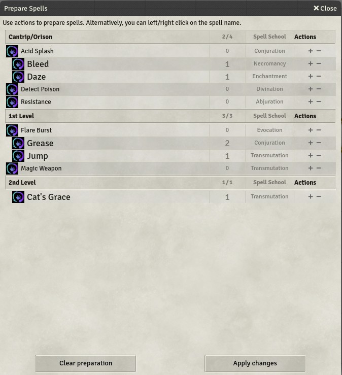
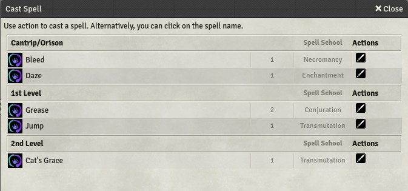

# Spellcaster utility for PF1

This module provides tools for spellcasters. 

## Prepare spells

Prepare the spells for the day in a few seconds.

## Cast spells

Cast a spell. The interface only displays prepared (and remaining) spells.

### Install module

To install the module, simply install *Spellcaster utility for PF1* from the offical list of Foundry VTT modules

To **manually install** the module, follow these instructions:

1. Start FVTT and browse to the Game Modules tab in the Configuration and Setup menu
2. Select the Install Module button and enter the following URL: https://raw.githubusercontent.com/svenwerlen/fvtt-spellcaster-utility-pf1/master/module.json
3. Click Install and wait for installation to complete 
